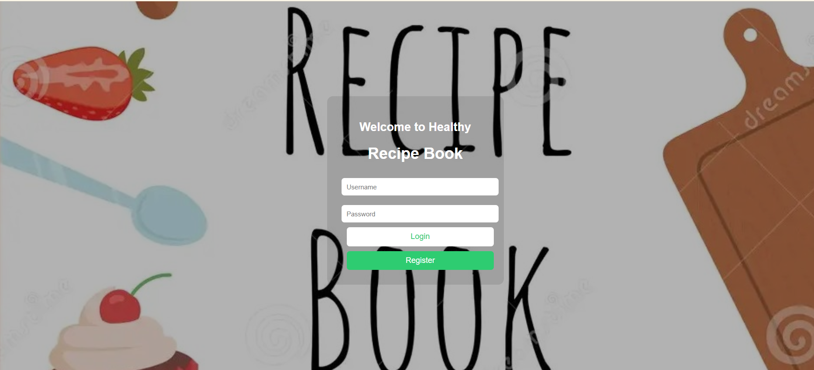

# 🍲 Healthy Recipe Book (Django Project)

This is a Django-based web application for managing and exploring healthy recipes. Users can register, log in, view a personalized dashboard, explore recipes, manage their favourite recipes, and interact with friends.

---
## 🎨 Figma Design

You can view the UI/UX design of this project on Figma:

🔗 [Recipe Book – Figma Design](https://www.figma.com/design/7hQMVe1kb6MXxcdYNZaEnJ/Recipe-Book?node-id=0-1&m=dev&t=223Jw4PPvkYh4RVJ-1)

---
## 📸 Screenshots

### 🔐 Login


### 📝 Register


### 🧭 Dashboard


### 🍛 Recipes


### 🧂 Ingredients


### 🍳 Preparation


### ❤️ Favourites


### 👥 Friends


### 🔍 Search


### 🙍 Account


### 🚪 Logout


---

## 🛠 Features

- User Registration & Login
- Personal Dashboard
- View Healthy Recipes with Ingredients & Preparation Steps
- Add Recipes to Favourites
- Search Recipes
- Edit Account Information
- Manage Friends
- Mobile-Responsive UI

---

## 🏁 Getting Started

1. Clone the repo:
   ```bash
   git clone https://github.com/Pallaini-Bhargavi/Healthy-Receipe-Book.git

---
# 1. Install Python and pip
Download and install Python 3.8+ from https://www.python.org/downloads/
pip comes bundled with Python.

# 2. Create and activate a virtual environment
python -m venv venv
source venv/bin/activate  # On Windows use: venv\Scripts\activate

# 3. Install Django
pip install django

# 4. Run the server
python manage.py runserver

# 5. Open in browser
http://127.0.0.1:8000/

---
## 🤝 Team Project

This project is a collaborative effort by:

- [Bhargavi Pallaini](https://www.linkedin.com/in/pallaini-bhargavi/)
- [Hemalatha Vuturu](https://www.linkedin.com/in/hemalatha-vuturu-5296192bb) 

---

## 💬 Suggestions & Queries

If you have any suggestions, feedback, or questions, feel free to reach out to us via LinkedIn or open an issue on the [GitHub repository](https://github.com/Pallaini-Bhargavi/Healthy-Receipe-Book/issues).

We appreciate your interest and support! 🌱
